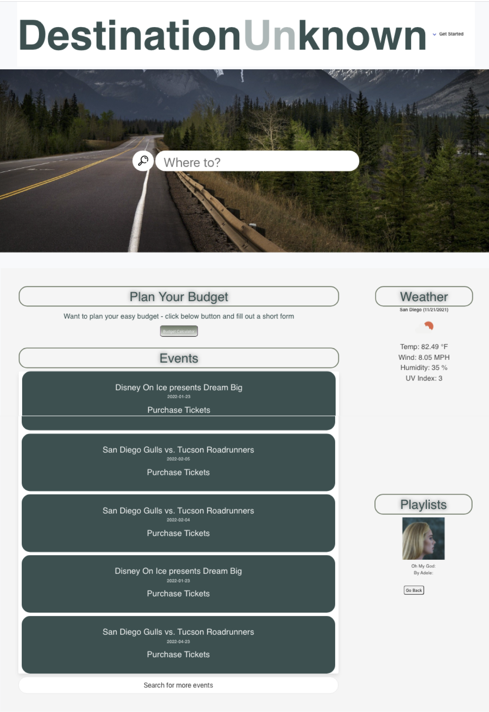
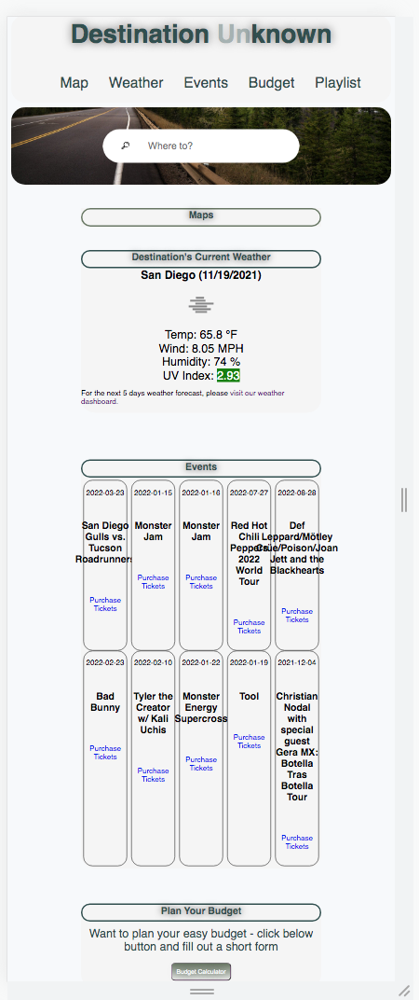

# Interactive Front-End Project: Destination Unknown
## Table of Contents

* [Description](#description)
* [Snippets](#snippets)
* [Technologies](#technologies)
* [Preview](#preview)
* [Links](#links)
* [Contributors](#contributors)

## Description

This project consisted on creating an interactive website to help people plan a road trip. Once the user provides a city they want to visit, the website will include information on events, current weather, and songs to sing along on the way. This website will run in the browser and feature dynamically updated HTML and CSS. This site takes all the variables of planning a trip and puts it in one easy to access place that can be shared among your group. This website will include 4 server-side APIs. 

## Snippets 

* **Fetching Weather API**
```            
var getWeatherData = function (city) {

    currentUrl = "https://api.openweathermap.org/data/2.5/weather?q=" + city + "&appid=" + apiKey + "&units=imperial";
    todayWeather.empty();
    fetch(currentUrl).then(function(response) {
        if (response.ok) {
            response.json().then(function(data){
                displayCurrentWeather (data);               
            });
        } else {
            return;
        }
        })
    };
```            

* **Fetching Ticketmaster API**

```            
 var getEvents = function() {
    var cityName = cityInputName.val().trim();
    console.log(cityName);
    console.log('city: ', cityName);
    fetch(tmRootURL + cityName +'&page=1&size=10&apikey=' + APIKey)
    .then(response =>
        response.json())
    .then(data => {
        console.log(data);
        displayEvents(data);
    });
};
```


* **Fetching Spotify API**
```            
     const getGenre = async (token) => {
        const result = await fetch(`https://api.spotify.com/v1/browse/categories?locale=sv_US`, {
            method: 'GET',
            headers: { 'Authorization' : 'Bearer ' + token}
        });
        const data = await result.json();
        return data.categories.items;
    }  
```   

## Technologies

* HTML
* CSS
* JavaScript
* Jquery

## Preview

This is a preview of Destination Unknown in a computer view. 



This is a preview of Destination Unknown on smaller screens. 



## Links

* [URL of the deployed application](https://khanhlam90.github.io/destination-unknown/)

* [URL of the GitHub repository](https://github.com/khanhlam90/destination-unknown.git)

## Contributors

* Ana Lucia Rojas - [Git Hub: analuciarojas](https://github.com/analuciarojas)

* Khanh Lam - [Git Hub: khanhlam90](https://github.com/khanhlam90)

* Maggie Finnegan - [Git Hub: magfinn](https://github.com/magfinn)

* Santiago Venegas - [Git Hub: santiagov916](https://github.com/santiagov916)